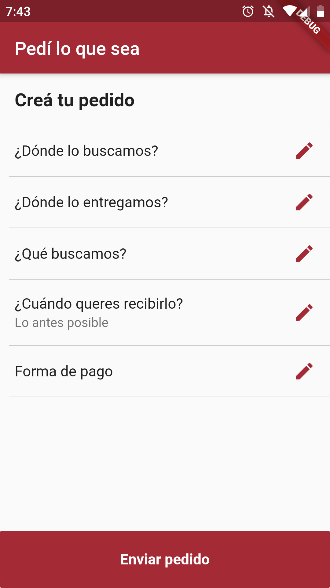
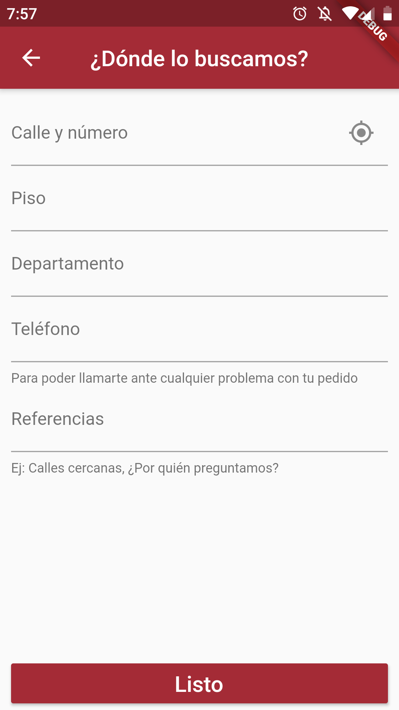
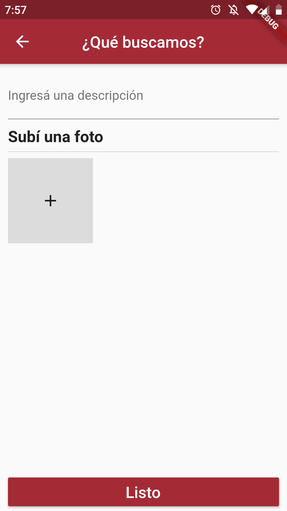
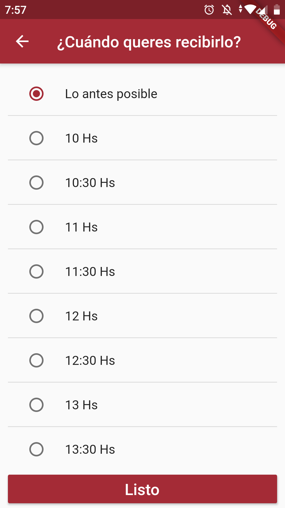
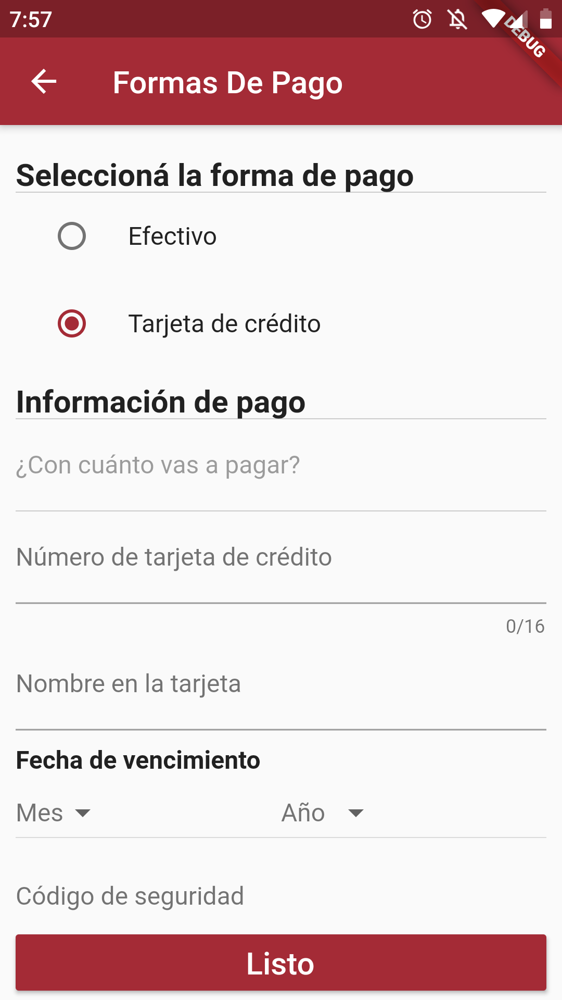
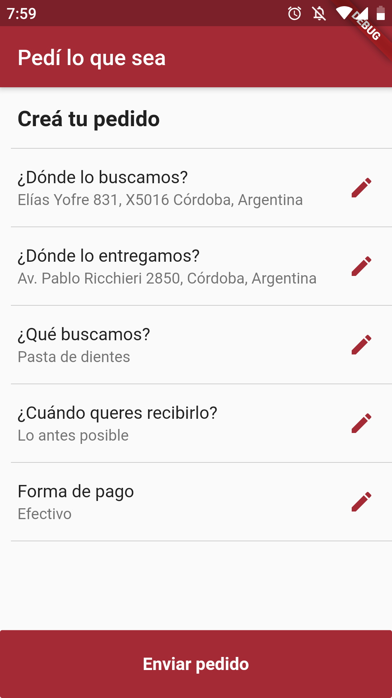

# App Mobile de servicio de Delivery
Implementacion con Flutter y Provider Pattern de user story "Realizar pedido de lo que sea", Materia Ingenieria de software.

# Screenshots de la aplicacion
  
  

# User Story
## Realizar pedido de "lo que sea"
Como Solicitante quiero realizar un Pedido de “lo que sea” para recibir algo en mi
domicilio que no está disponible en los comercios adheridos
### Criterios de aceptacion
* Se debe indicar qué debe buscar el Cadete con un campo de texto.
* Se puede adjuntar opcionalmente una foto en formato JPG con un tamaño
máximo de 5 MB.
* Se debe indicar la dirección del comercio en forma textual (calle, número, ciudad
y referencia opcional en formato de texto) o seleccionando un punto en un mapa
interactivo de Google Maps.
* Se debe indicar la dirección de entrega (calle, número, ciudad y referencia
opcional en formato de texto). La ciudad podrá ser seleccionada de un listado de
Ciudades disponibles.
* Se debe seleccionar la forma de pago: Efectivo o Tarjeta VISA, en caso de haber
seleccionado pago en Efectivo el monto con el que va a pagar. En caso de seleccionar
Tarjeta VISA debe ingresar el número de la tarjeta, nombre y apellido del Titular, fecha
de vencimiento (MM/AAAA) y CVC.
* Debe ingresar cuando quiere recibirlo: “Lo antes posible” o una fecha/hora de
recepción).

### Pruebas de aceptacion
* Probar realizar un Pedido de “lo que sea” en efectivo “lo antes posible” (pasa)
* Probar realizar un Pedido de “lo que sea” con tarjeta “lo antes posible” (pasa)
* Probar realizar un Pedido de “lo que sea” programando la fecha/hora de entrega (pasa)
* Probar realizar un Pedido de “lo que sea” con una tarjeta inválida (falla)
* Probar realizar un Pedido de “lo que sea” con una tarjeta MasterCard (falla)
* Probar realizar un Pedido de “lo que sea” en efectivo sin indicar el monto a pagar (falla)
* Probar realizar un Pedido de “lo que sea” programando una fecha/hora de entrega no válida
(falla)
* Probar realizar un Pedido de “lo que sea” sin especificar qué buscar (falla)
* Probar realizar un Pedido de “lo que sea” adjuntando una foto (pasa)
* Probar realizar un Pedido de “lo que sea” sin indicar la dirección del comercio (falla)
* Probar realizar un Pedido de “lo que sea” seleccionando la dirección del comercio en el mapa
interactivo (pasa)
